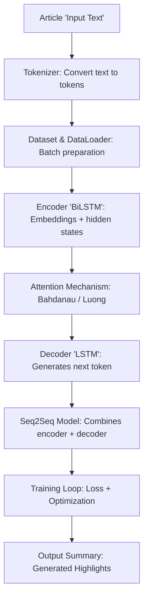

## Seq2Seq Model Newspaper Text Summarization

---

## Data Loading
- **`import numpy as np`** → Loads NumPy, a library for numerical computations.
- **`import pandas as pd`** → Loads Pandas, used for handling tabular data (CSV files).
- **`os.walk('/kaggle/input')`** → Iterates through files in the Kaggle input directory.
- **`pd.read_csv(...)`** → Reads CSV files into Pandas DataFrames (`train_df`, `val_df`, `test_df`).

---

## Dataset Structure
- **`train_df.shape`** → Shows rows × columns of the training dataset.
- **`train_df.head()`** → Displays the first few rows.
- **`train_df.columns`** → Lists column names (e.g., `"article"`, `"highlights"`).
- **`train_df.iloc[0]["article"]`** → Accesses the first article.
- **`train_df.iloc[0]["highlights"]`** → Accesses the summary (target).

---

## Tokenization
- **`AutoTokenizer.from_pretrained("facebook/bart-base")`** → Loads a pretrained tokenizer for BART.
- **`tokenizer(..., max_length=512, truncation=True, padding="max_length")`**  
  - `max_length` → Maximum sequence length.  
  - `truncation=True` → Cuts off text longer than `max_length`.  
  - `padding="max_length"` → Pads shorter sequences to fixed length.  
- **`input_ids`** → Token IDs (numerical representation of text).  
- **`attention_mask`** → Marks which tokens are real vs. padding.

---

##  Dataset Class
- **`torch.utils.data.Dataset`** → Base class for custom datasets.
- **`__len__`** → Returns dataset size.
- **`__getitem__`** → Defines how to fetch one sample (article + summary).
- **`DataLoader(..., batch_size=16, shuffle=True)`** → Loads batches of 16 samples, shuffling order.

---

##  Attention Mechanisms
### Bahdanau Attention
- **Additive attention**: Combines encoder outputs + decoder state with learned weights.
- **`self.W_h` / `self.W_s`** → Linear transformations of encoder/decoder states.
- **`torch.tanh(...)`** → Non-linear activation.
- **`F.softmax(scores, dim=-1)`** → Converts scores into probability distribution.
- **`context`** → Weighted sum of encoder outputs.

### Luong Attention
- **Dot-product / general attention**: Uses similarity between encoder outputs and decoder state.
- **`self.W`** → Optional linear projection for "general" attention.
- **`torch.bmm(...)`** → Batch matrix multiplication for computing scores.

---

##  Encoder
- **`nn.Embedding(vocab_size, emb_dim)`** → Converts token IDs into dense vectors.
- **`nn.LSTM(..., bidirectional=True)`** → Processes sequence forward + backward.
- **`pack_padded_sequence`** → Efficiently handles variable-length sequences.
- **`h_cat` / `c_cat`** → Concatenated hidden and cell states from both directions.

---

##  Decoder
- **`nn.Embedding`** → Embeds target tokens.
- **`self.rnn`** → LSTM that takes both embeddings + context vector.
- **`self.attention`** → Computes context from encoder outputs.
- **`self.out`** → Linear layer projecting to vocabulary size (logits).
- **`logits`** → Raw scores for each word in vocabulary.

---

##  Seq2Seq Model
- **`bos_id` / `eos_id`** → Special tokens for beginning/end of sequence.
- **Teacher forcing** → During training, sometimes feed the true next token instead of predicted.
- **Greedy decoding** → At inference, pick the highest-probability token at each step.

---

##  Training Setup
- **`torch.cuda.device_count()`** → Number of GPUs available.
- **`torch.device("cuda" if torch.cuda.is_available() else "cpu")`** → Chooses GPU if available.
- **`PAD` / `BOS` / `EOS`** → Special token IDs from tokenizer.
- **Hyperparameters**:  
  - `emb_dim = 256` → Embedding size.  
  - `hidden_size = 512` → LSTM hidden dimension.  
- **`optim.Adam(...)`** → Optimizer for gradient descent.
- **`nn.CrossEntropyLoss(ignore_index=PAD, label_smoothing=0.1)`** → Loss function ignoring padding tokens, smoothing labels.

---

##  Training Loop
- **`num_epochs = 5`** → Number of passes through dataset.
- **`manual_batches = 50`** → no. of batches per epoch
- **`manual_batch_size = 8`** → controls how many samples per batch
- **`model.train()`** → Sets model to training mode.
- **`src_len = batch["src_mask"].sum(dim=1)`** → Computes actual sequence lengths.
- **`loss.backward()`** → Backpropagation.
- **`clip_grad_norm_`** → Prevents exploding gradients.
- **`optimizer.step()`** → Updates weights.
- **`total_loss/len(train_loader)`** → Average loss per epoch.

---

##  Multi-GPU Training
- **`nn.DataParallel(model)`** → Wraps model to run on multiple GPUs.
- **`model.to(device)`** → Moves model to GPU(s).

---

## Workflow Overview

---

## Comparison Table

| Aspect | **Bahdanau Attention (Additive)** | **Luong Attention (Multiplicative)** |
|--------|-----------------------------------|--------------------------------------|
| **Introduced by** | Bahdanau et al., 2015 (a.k.a. *Additive Attention*) | Luong et al., 2015 (a.k.a. *Multiplicative Attention*) |
| **Computation** | Uses a feed‑forward network: score = \(v^T \tanh(W_h h_t + W_s s_t)\) | Uses dot product or general form: score = \(h_t^T W s_t\) |
| **Complexity** | Slightly higher (extra parameters and non‑linear layer) | Lower (simpler dot product or linear projection) |
| **Alignment Function** | Non‑linear (MLP + tanh) → more flexible | Linear (dot product or bilinear) → faster |
| **Performance** | Often better for small datasets or complex alignments | Often faster and scales better to large datasets |
| **Interpretability** | Provides smoother, learned alignment weights | Simpler, but may be less expressive |
| **Training Speed** | Slower due to extra parameters | Faster due to fewer computations |
| **Memory Usage** | Higher (extra weight matrices) | Lower (leaner computation) |
| **Use Cases** | Good when fine‑grained alignment is critical (e.g., machine translation with small data) | Good for large‑scale tasks (e.g., summarization, speech recognition) |

---

## Advantages & Disadvantages

### Bahdanau Attention
-  Captures complex, non‑linear relationships between encoder and decoder states.  
-  Often yields better alignment quality, especially in low‑resource settings.  
-  Slower training due to extra parameters and MLP computation.  
-  More memory‑intensive.  

### Luong Attention
-  Computationally efficient (dot product is faster).  
-  Scales well to large datasets and long sequences.  
-  Simpler to implement and integrate.  
-  Less expressive; may miss subtle alignments.  
-  Can underperform in small datasets compared to Bahdanau.  

---

  
- **Bahdanau** is preferred when accuracy and nuanced alignment matter more than speed.  
- **Luong** is preferred when efficiency and scalability are the priority.  
